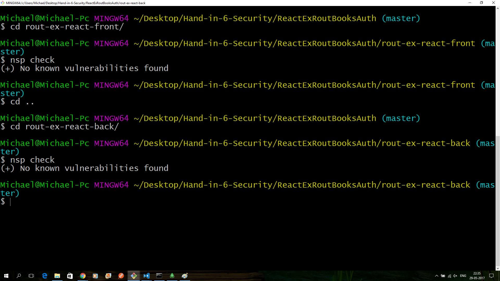

# Hand-in-6-Security
### The exercise for this period is here: [Security Exercise](https://docs.google.com/document/d/1ZY-pZDQfwEoQlVk0Qn-lKnpa40MOl-hQdGW9Fx2A5XE/edit)

### Instructions
- The first thing you have to do is run a local mongoDB, when that is done run the file createDummyUser.js inside the rout-ex-react-back. This creates two users: `username: Michael, password: mich123` and `username: Christian, password: chris321`.
- bcrypt is used for the passwords to hash them and then salted like described [here](https://stackoverflow.com/questions/6832445/how-can-bcrypt-have-built-in-salts)
- JWT is used for this application. The serversecret is inside the index.js file and isn't hidden, will be later on (maybe).
- Helmet is used a little in the backend express server.
- To test the security, try adding a book without being logged in, then try it again while logged in. Update and delete is added aswell but for some reason it won't show the details window, will try and fix it later some day.
- The backend and the frontend has been checked with [nsp](https://nodesecurity.io/), here is the proof:

backend/frontend:

## Learning goals:
>## Explain basic security terms like authentication, authorization, confidentiality, integrity, SSL/TLS and provide examples of how you have used them.

#### Authentication: 
the process or action of proving or showing something to be true, genuine, or valid.
 
#### Authorization: 
Authorization is the function of specifying access rights to resources related to information security and computer security in general and to access control in particular. More formally, "to authorize" is to define an access policy. For example, human resources staff is normally authorized to access employee records and this policy is usually formalized as access control rules in a computer system.
 
#### Confidentiality:
The state of keeping or being kept secret or private.
In information security, confidentiality "is the property, that information is not made available or disclosed to unauthorized individuals, entities, or processes"
 
#### Integrity:
In information security, data integrity means maintaining and assuring the accuracy and completeness of data over its entire life-cycle. This means that data cannot be modified in an unauthorized or undetected manner. This is not the same thing as referential integrity in databases, although it can be viewed as a special case of consistency as understood in the classic ACID model of transaction processing. Information security systems typically provide message integrity in addition to data confidentiality.
 
#### SSL/TLS:
Transport Layer Security (TLS) and its predecessor, Secure Sockets Layer (SSL), both frequently referred to as "SSL", are cryptographic protocols that provide communications security over a computer network. Several versions of the protocols find widespread use in applications such as web browsing, email, Internet faxing, instant messaging, and voice-over-IP (VoIP). Websites use TLS to secure all communications between their servers and web browsers.
The Transport Layer Security protocol aims primarily to provide privacy and data integrity between two communicating computer applications. When secured by TLS, connections between a client (e.g., a web browser) and a server (e.g., wikipedia.org) have one or more of the following properties:
 
#### Example is the big exercise seed we have made for this period: [Seed-exercise](https://github.com/KongBoje/Hand-in-6-Security/tree/master/ReactExRoutBooksAuth).

---

>## Explain, at a fundamental level, the technologies involved, and the steps required, to setup a SSL connection between a browser and a server, and how to use SSL in a secure way.

TBD

---

>## How can we "prevent" third party code used, by either our Java or NodeJS applications, from injecting dangerous code into our code base?

By removing code tags from text. Dont let users try to insert code into the database.

---

>## Explain about Node tools like Helmet and nsp (and the Node Security Project). What do they do, and how have you used them.

#### Helmet
TBD

#### NSP
NSP stands for Node Security Platform, which adds security checks right into your pull requests. 

Homepage: [NSP](https://nodesecurity.io/)

NSP checks the list of middleware and can know if there are vulnerabilities in them. 
Use "NSP CHECK" to check.
 
Nsp check example:

---

>## Explain basic security threads like: Cross Site Scripting (XSS), SQL Injection and whether something similar to SQL injection is possible with NoSQL databases like MongoDB, and DOS-attacks. Explain/demonstrate ways to cope with these problems, preferably via your suggestion for a seed.

---

>## Explain and demonstrate ways to protect user passwords on our backend, and why this is necessary.

---

>## Explain about password hashing, salts and the difference between Bcrypt and older (not suited) algorithms like sha1, md5 etc.

---

>## Explain about JSON Web Tokens (jwt) and why they are extremely suited for a REST-based API

---

>## Explain and demonstrate a basic NodeJS/React application and how it handles authentication, authorization, prevents against Cross Site Scripting and other basic web-threats.
