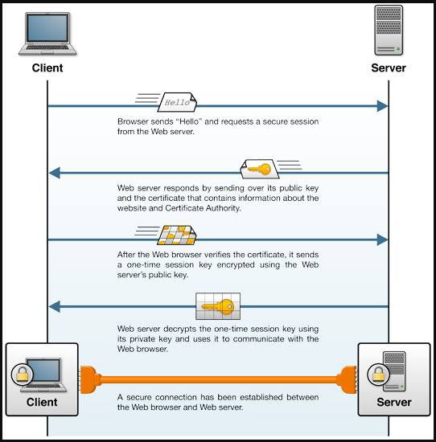
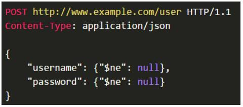
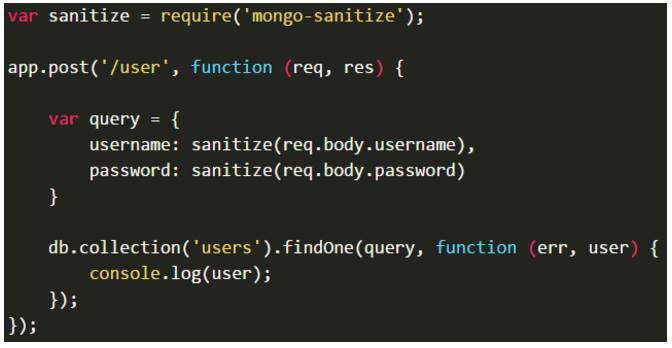

# Hand-in-6-Security
### The exercise for this period is here: [Security Exercise](https://docs.google.com/document/d/1ZY-pZDQfwEoQlVk0Qn-lKnpa40MOl-hQdGW9Fx2A5XE/edit)

### Instructions
- The first thing you have to do is run a local mongoDB, when that is done run the file createDummyUser.js inside the rout-ex-react-back. This creates two users: `username: Michael, password: mich123` and `username: Christian, password: chris321`.
- bcrypt is used for the passwords to hash them and then salted like described [here](https://stackoverflow.com/questions/6832445/how-can-bcrypt-have-built-in-salts)
- JWT is used for this application. The serversecret is inside the index.js file and isn't hidden, will be later on (maybe).
- Helmet is used a little in the backend express server.
- To test the security, try adding a book without being logged in, then try it again while logged in. Update and delete is added aswell but for some reason it won't show the details window, will try and fix it later some day.
- The backend and the frontend has been checked with [nsp](https://nodesecurity.io/), here is the proof:

backend/frontend:

## Learning goals:
>## Explain basic security terms like authentication, authorization, confidentiality, integrity, SSL/TLS and provide examples of how you have used them.

#### Authentication: 
the process or action of proving or showing something to be true, genuine, or valid.
 
#### Authorization: 
Authorization is the function of specifying access rights to resources related to information security and computer security in general and to access control in particular. More formally, "to authorize" is to define an access policy. For example, human resources staff is normally authorized to access employee records and this policy is usually formalized as access control rules in a computer system.
 
#### Confidentiality:
The state of keeping or being kept secret or private.
In information security, confidentiality "is the property, that information is not made available or disclosed to unauthorized individuals, entities, or processes"
 
#### Integrity:
In information security, data integrity means maintaining and assuring the accuracy and completeness of data over its entire life-cycle. This means that data cannot be modified in an unauthorized or undetected manner. This is not the same thing as referential integrity in databases, although it can be viewed as a special case of consistency as understood in the classic ACID model of transaction processing. Information security systems typically provide message integrity in addition to data confidentiality.
 
#### SSL/TLS:
Transport Layer Security (TLS) and its predecessor, Secure Sockets Layer (SSL), both frequently referred to as "SSL", are cryptographic protocols that provide communications security over a computer network. Several versions of the protocols find widespread use in applications such as web browsing, email, Internet faxing, instant messaging, and voice-over-IP (VoIP). Websites use TLS to secure all communications between their servers and web browsers.
The Transport Layer Security protocol aims primarily to provide privacy and data integrity between two communicating computer applications. When secured by TLS, connections between a client (e.g., a web browser) and a server (e.g., wikipedia.org) have one or more of the following properties:
 
#### Example is the big exercise seed we have made for this period: [Seed-exercise](https://github.com/KongBoje/Hand-in-6-Security/tree/master/ReactExRoutBooksAuth).

---

>## Explain, at a fundamental level, the technologies involved, and the steps required, to setup a SSL connection between a browser and a server, and how to use SSL in a secure way.

An SSL connection between a client and server is set up by a handshake, the goals of which are:
To satisfy the client that it is talking to the right server (and optionally visa versa)
For the parties to have agreed on a “cipher suite”, which includes which encryption algorithm they will use to exchange data
For the parties to have agreed on any necessary keys for this algorithm
Once the connection is established, both parties can use the agreed algorithm and keys to securely send messages to each other. We will break the handshake up into 3 main phases - Hello, Certificate Exchange and Key Exchange.

**Hello** - The handshake begins with the client sending a ClientHello message. This contains all the information the server needs in order to connect to the client via SSL, including the various cipher suites and maximum SSL version that it supports. The server responds with a ServerHello, which contains similar information required by the client, including a decision based on the client’s preferences about which cipher suite and version of SSL will be used.
 
**Certificate Exchange** - Now that contact has been established, the server has to prove its identity to the client. This is achieved using its SSL certificate, which is a very tiny bit like its passport. An SSL certificate contains various pieces of data, including the name of the owner, the property (eg. domain) it is attached to, the certificate’s public key, the digital signature and information about the certificate’s validity dates. The client checks that it either implicitly trusts the certificate, or that it is verified and trusted by one of several Certificate Authorities (CAs) that it also implicitly trusts. Much more about this shortly. Note that the server is also allowed to require a certificate to prove the client’s identity, but this typically only happens in very sensitive applications.
 
**Key Exchange** - The encryption of the actual message data exchanged by the client and server will be done using a symmetric algorithm, the exact nature of which was already agreed during the Hello phase. A symmetric algorithm uses a single key for both encryption and decryption, in contrast to asymmetric algorithms that require a public/private key pair. Both parties need to agree on this single, symmetric key, a process that is accomplished securely using asymmetric encryption and the server’s public/private keys.
 
The client generates a random key to be used for the main, symmetric algorithm. It encrypts it using an algorithm also agreed upon during the Hello phase, and the server’s public key (found on its SSL certificate). It sends this encrypted key to the server, where it is decrypted using the server’s private key, and the interesting parts of the handshake are complete. The parties are sufficiently happy that they are talking to the right person, and have secretly agreed on a key to symmetrically encrypt the data that they are about to send each other. HTTP requests and responses can now be sent by forming a plaintext message and then encrypting and sending it. The other party is the only one who knows how to decrypt this message, and so Man In The Middle Attackers are unable to read or modify any requests that they may intercept.

---

>## How can we "prevent" third party code used, by either our Java or NodeJS applications, from injecting dangerous code into our code base?

By removing code tags from text. Dont let users try to insert code into the database.

---

>## Explain about Node tools like Helmet and nsp (and the Node Security Project). What do they do, and how have you used them.

#### Helmet:
TBD

#### NSP:
NSP stands for Node Security Platform, which adds security checks right into your pull requests. 
Homepage: [NSP](https://nodesecurity.io/)

NSP checks the list of middleware and can know if there are vulnerabilities in them. 
Use "NSP CHECK" to check.
 
Nsp check example:

---

>## Explain basic security threads like: Cross Site Scripting (XSS), SQL Injection and whether something similar to SQL injection is possible with NoSQL databases like MongoDB, and DOS-attacks. Explain/demonstrate ways to cope with these problems, preferably via your suggestion for a seed.

#### XSS:
Cross-site scripting (XSS) is a type of computer security vulnerability typically found in web applications. XSS enables attackers to inject client-side scripts into web pages viewed by other users. A cross-site scripting vulnerability may be used by attackers to bypass access controls such as the same-origin policy. Cross-site scripting carried out on websites accounted for roughly 84% of all security vulnerabilities documented by Symantec as of 2007. Their effect may range from a petty nuisance to a significant security risk, depending on the sensitivity of the data handled by the vulnerable site and the nature of any security mitigation implemented by the site's owner.
 
#### SQL Injection:
SQL Injection is a code injection technique, used to attack data-driven applications, in which nefarious SQL statements are inserted into an entry field for execution (e.g. to dump the database contents to the attacker). SQL injection must exploit a security vulnerability in an application's software, for example, when user input is either incorrectly filtered for string literal escape characters embedded in SQL statements or user input is not strongly typed and unexpectedly executed. SQL injection is mostly known as an attack vector for websites but can be used to attack any type of SQL database.
SQL injection attacks allow attackers to spoof identity, tamper with existing data, cause repudiation issues such as voiding transactions or changing balances, allow the complete disclosure of all data on the system, destroy the data or make it otherwise unavailable, and become administrators of the database server.
In a 2012 study, it was observed that the average web application received 4 attack campaigns per month, and retailers received twice as many attacks as other industries.

#### SQL injection with MongoDB:
Is it possible? 
Yes it is.

NoSQL Injection is the equivalent for the NoSQL world. The attack tries to inject code when the inputs are not sanitized and the solution is simply to sanitize them before using.

For example, using Node.js and MongoDB: 

Let's suppose that we receive the following request: 

As **$ne** is the "not equal" operator, this request would return the first user (possibly an admin) without knowing its name or password.
The solution in this case is to sanitize(or to clean) the input before using them. A good options is [mongo-sanitize](https://github.com/vkarpov15/mongo-sanitize):

If you are using Mongoose, you don't need to sanitize the inputs. In this case, you just need to set the properties to be typed as string. If someone passes an object like **{ $ne: null }**, Mongoose will convert it to a string and no harm will be done.
 
#### DOS attacks: 
Denial of service is what makes a service very slow.
**ISPS**(International Ship and Port Facility Security) may have to “null route” the victim, there is not much you can do.
You can try banning/filtering ips but it will only cut down on the traffic, not stop it.

---

>## Explain and demonstrate ways to protect user passwords on our backend, and why this is necessary.
Hashing and salting. Hashing goes one way, so you cannot recover a password just by looking at the hash. But you can make a database of hashes and the source passwords to try to recover them. Salting passwords means they all need a new hash, and it will be harder to create such a database of hashes.

---

>## Explain about password hashing, salts and the difference between Bcrypt and older (not suited) algorithms like sha1, md5 etc.
Bcrypt is like sha1 and md5, but much slower. This makes it more time consuming to crack hashes.

---

>## Explain about JSON Web Tokens (jwt) and why they are extremely suited for a REST-based API
JSON Web Token (JWT) is a JSON-based open standard for creating access tokens that assert some number of claims. For example, a server could generate a token that has the claim "logged in as admin" and provide that to a client. The client could then use that token to prove that it is logged in as admin. The tokens are signed by the server's key, so the client and server are both able to verify that the token is legitimate. The tokens are designed to be compact, URL-safe and usable especially in web browser single sign-on (SSO) context. JWT claims can be typically used to pass identity of authenticated users between an identity provider and a service provider, or any other type of claims as required by business processes. The tokens can also be authenticated and encrypted.

---

>## Explain and demonstrate a basic NodeJS/React application and how it handles authentication, authorization, prevents against Cross Site Scripting and other basic web-threats.
We haven’t made one that prevents XSS but to do it you should ensure you don’t let people put plain code into your database.

The app is here: [Seed-Exercise](https://github.com/KongBoje/Hand-in-6-Security/tree/master/ReactExRoutBooksAuth)
